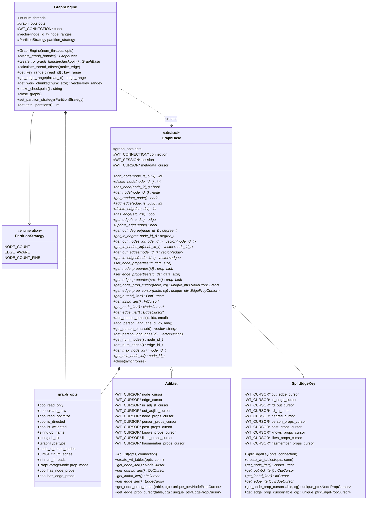
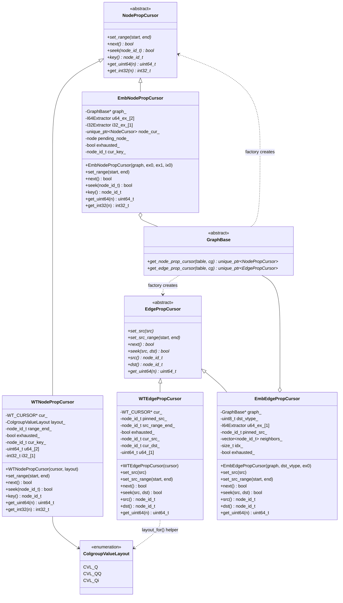

# Flexograph Class Diagrams

Three diagrams covering the full class hierarchy:
1. **Graph layer** — GraphEngine, GraphBase, AdjList, SplitEdgeKey
2. **Topology cursors** — table_iterator hierarchy and concrete implementations
3. **Property cursors** — NodePropCursor/EdgePropCursor hierarchy

---

## 1. Graph Layer

---

## 2. Topology Cursors

```mermaid
classDiagram
    direction TB

    class table_iterator {
        #WT_CURSOR* cursor
        #WT_SESSION* session
        #bool is_first
        #bool has_next
        #bool directed
        #bool read_opt
        +has_more() bool
        +reset()
        +close()
    }

    class OutCursor {
        <<abstract>>
        #key_range keys
        #node_id_t num_nodes
        +set_key_range(key_range)*
        +set_num_nodes(uint32_t)
        +next(adjlist*)*
        +next(adjlist*, node_id_t)*
    }

    class InCursor {
        <<abstract>>
        #key_range keys
        #node_id_t num_nodes
        +set_key_range(key_range)*
        +set_num_nodes(node_id_t)
        +next(adjlist*)*
        +next(adjlist*, node_id_t)*
    }

    class NodeCursor {
        <<abstract>>
        #key_range keys
        +set_key_range(key_range)*
        +next(node*)*
        +next(node*, node_id_t)*
    }

    class EdgeCursor {
        <<abstract>>
        #key_pair start_edge
        #key_pair end_edge
        #bool get_weight
        +set_key_range(edge_range)*
        +next(edge*)*
        +dump_range()
    }

    class AdjOutCursor {
        -bool all_nodes
        +AdjOutCursor(cursor, session)
        +AdjOutCursor(cursor, session, directed, read_opt)
        +setAllNodes(bool)
        +set_key_range(key_range)
        +next(adjlist*)
        +next(adjlist*, node_id_t)
    }

    class AdjInCursor {
        -bool all_nodes
        +AdjInCursor(cursor, session)
        +AdjInCursor(cursor, session, directed, read_opt)
        +setAllNodes(bool)
        +set_key_range(key_range)
        +next(adjlist*)
        +next(adjlist*, node_id_t)
    }

    class AdjNodeCursor {
        -WT_CURSOR* in_cur
        +AdjNodeCursor(cursor, session)
        +AdjNodeCursor(cursor, session, directed, read_opt)
        +set_key_range(key_range)
        +next(node*)
        +next(node*, node_id_t)
    }

    class AdjEdgeCursor {
        -adjlist current_adjlist
        -int pos
        +AdjEdgeCursor(cursor, session)
        +AdjEdgeCursor(cursor, session, directed, read_opt)
        +set_key_range(edge_range)
        +next(edge*)
    }

    class SplitEKeyOutCursor {
        +SplitEKeyOutCursor(cursor, session, directed, read_opt)
        +set_key_range(key_range)
        +next(adjlist*)
        +next(adjlist*, node_id_t)
    }

    class SplitEkeyInCursor {
        +SplitEkeyInCursor(cursor, session, directed, read_opt)
        +set_key_range(key_range)
        +next(adjlist*)
        +next(adjlist*, node_id_t)
    }

    class SplitEKeyNodeCursor {
        +SplitEKeyNodeCursor(cursor, session)
        +set_key_range(key_range)
        +next(node*)
        +next(node*, node_id_t)
    }

    class SplitEKeyEdgeCursor {
        +SplitEKeyEdgeCursor(cursor, session, directed, read_opt)
        +set_key_range(edge_range)
        +next(edge*)
    }

    table_iterator <|-- OutCursor
    table_iterator <|-- InCursor
    table_iterator <|-- NodeCursor
    table_iterator <|-- EdgeCursor

    OutCursor  <|-- AdjOutCursor
    InCursor   <|-- AdjInCursor
    NodeCursor <|-- AdjNodeCursor
    EdgeCursor <|-- AdjEdgeCursor

    OutCursor  <|-- SplitEKeyOutCursor
    InCursor   <|-- SplitEkeyInCursor
    NodeCursor <|-- SplitEKeyNodeCursor
    EdgeCursor <|-- SplitEKeyEdgeCursor
```

---

## 3. Property Cursors

